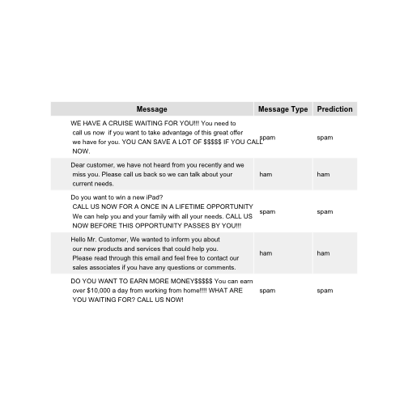

Email Campaign Spam Detector
========================================================
author: Jose M. Romero
date: April 23, 2015
***


RATIONALE - Marketer Needs
========================================================

Marketers are various companies continuously try to reach their customers 
through email campaigns. These campaigns cost monet but unfortunately a 
lot of these emails are sent directly to the recipient's **spam** folder.

We propose to provide marketers with a tool they can use to validate the
content of their email campaigns for **spam** triggers before they send them.

With this tool, a marketer would only need to copy-paste the text of their
email and they will automatically know if the email will be considered **spam**.

Process & Limitations
========================================================
In order to determine whether an email is **spam** or not, I used the **kernlab spam**
dataset and created a Random Forest model. 

The model yields a **90%** accuracy, so it is not perfect, 
but it should catch many of the mistakes marketers can make when putting together
new email campaigns.

Next we will look at some sample output from the tool.

Sample Tool Results
========================================================
 

About the Model
========================================================
<small>
In order to generate our model, we separated our dataset into train (70% of the data) and test (30% of the data). We then built the model around the training data.

Next, we found which outcomes had Near Zero Variance and removed them from the model (this reduced the number of outcomes from 57 to 9). Finally we built a Random Forest model that yields the following confusion matrix:

```
Confusion Matrix and Statistics

          Reference
Prediction nonspam spam
   nonspam     780   82
   spam         56  461
                                          
               Accuracy : 0.8999          
                 95% CI : (0.8829, 0.9153)
    No Information Rate : 0.6062          
    P-Value [Acc > NIR] : < 2e-16         
                                          
                  Kappa : 0.7886          
 Mcnemar's Test P-Value : 0.03333         
                                          
            Sensitivity : 0.9330          
            Specificity : 0.8490          
         Pos Pred Value : 0.9049          
         Neg Pred Value : 0.8917          
             Prevalence : 0.6062          
         Detection Rate : 0.5656          
   Detection Prevalence : 0.6251          
      Balanced Accuracy : 0.8910          
                                          
       'Positive' Class : nonspam         
                                          
```
</small>
